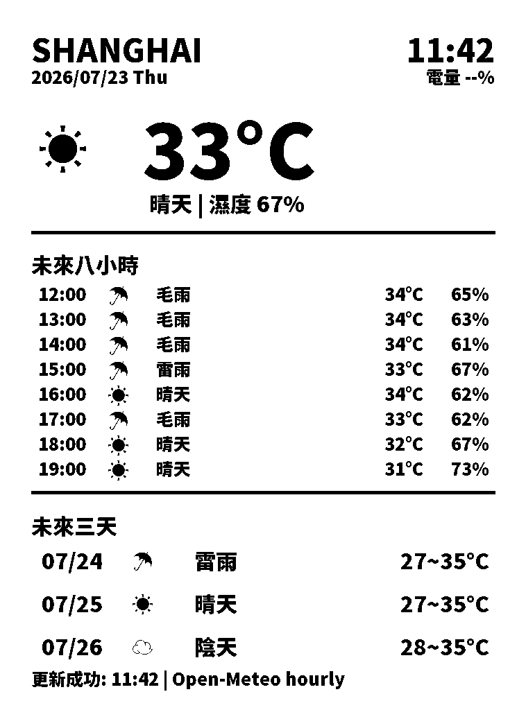
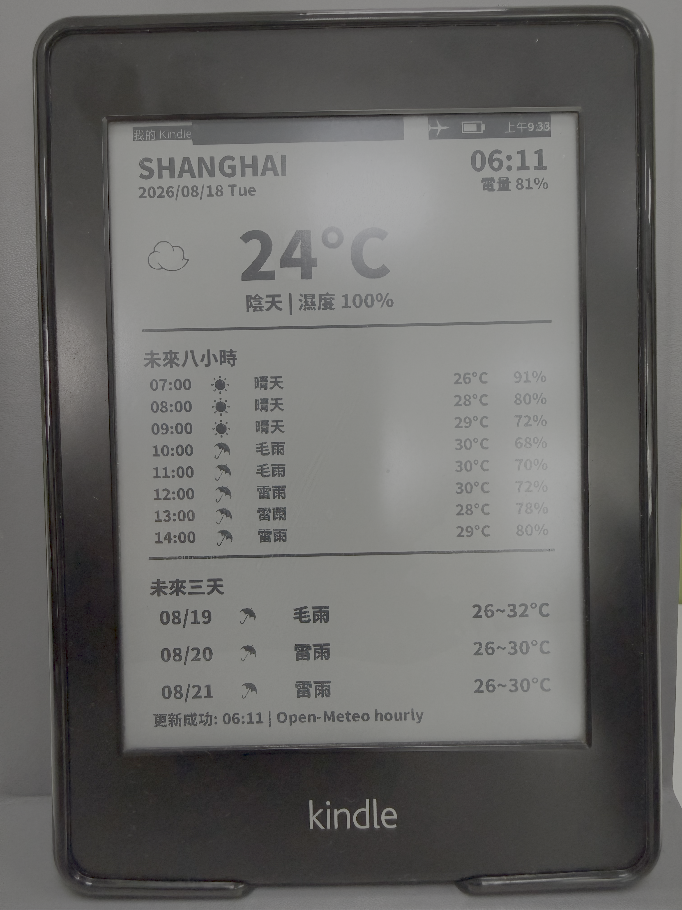

# Kindle PW1 Weather Station

<p align="center">
  <a href="#繁體中文"><strong>繁體中文</strong></a>
  ·
  <a href="#中文"><strong>简体中文</strong></a>
  ·
  <a href="#english"><strong>English</strong></a>
</p>

---

## 繁體中文

<p align="center">
  <strong>繁體中文</strong>
  ·
  <a href="#中文">简体中文</a>
  ·
  <a href="#english">English</a>
</p>

Kindle Paperwhite 1 天氣站擴充套件。它會把上海天氣、未來 8 小時逐小時預報、未來 3 天天氣預報渲染成灰階 `weather.png`，並顯示在 Kindle E Ink 螢幕上。

### PNG 範例圖




### KUAL 選單範例

```text
Weather Clock
├─ Update Once
├─ Install 4h Schedule
└─ Remove Schedule
```

### 功能

- 目前天氣、溫度、濕度、日期、時間與電池百分比
- 未來 8 小時逐小時顯示，並顯示未來 3 天天氣
- 可在 `config.xml` 選擇中文或英文顯示
- 使用 Open-Meteo 小時預報，不需要 API key
- 只在更新時開啟 Wi-Fi，完成後自動關閉
- 自動更新時保持 Kindle 喚醒，確保背景排程可在每個週期執行
- `worker.sh` 永遠只做單次更新，跑完就恢復省電狀態並退出
- `schedule.sh` 在週一至週五的 08:00、12:00、16:00、20:00 自動更新

### 更新模式

- `weatheriot` 模式：在 Kindle 本機執行 `weatheriot/worker.sh`，產生 `weather.png` 後顯示；不需要圖片伺服器。
- Online Screensaver 模式：由 `onlinescreensaver/bin/config.sh` 的 `IMAGE_URI` 從 URL 下載 PNG，並交由 `linkss` 顯示。
- 兩者可擇一使用；`IMAGE_URI=""` 時會自動使用本機 `weatheriot` 模式。

### 檔案

- `weatheriot/` - Kindle 擴充套件檔案，包含腳本、設定、字型與預覽圖片

### 安裝

1. 將 `weatheriot/` 目錄內的檔案複製到 Kindle：

   ```text
   /mnt/us/extensions/weatheriot
   ```

2. 修改 `weatheriot/config.xml`：

   ```xml
   <city>Shanghai</city>
   <lat>31.2304</lat>
   <lon>121.4737</lon>
   <lang>zh</lang>
   ```

   `lang` 控制圖片顯示語言：

   - `zh` - 中文
   - `en` - 英文

3. 在 KUAL 開啟 `Weather Clock`，選擇：

   - `Update Once` - 立即更新一次
   - `Install 4h Schedule` - 安裝週一至週五 08:00、12:00、16:00、20:00 的定時更新
   - `Remove Schedule` - 停止自動更新

### 需求

- 已越獄 Kindle Paperwhite 1
- KUAL
- Kindle 上的 Python 3
- Python packages: `requests`, `Pillow`
- 不需要天氣 API key

### 注意事項

- `weather.png` 是預覽用產生圖片；Kindle 實際執行時會覆蓋它。
- 將 `weatheriot/` 目錄內的檔案下載到 Kindle 的 `/mnt/us/extensions/weatheriot`；`weather.png` 可選，只是首次顯示前的預覽圖。
- `weather.tmp.png`、`log.txt`、`schedule.pid` 與執行診斷檔案應留在本機，不提交到 GitHub。
- `worker.sh` 不會常駐；每次更新後會關閉 Wi-Fi。自動排程運作時會保持 `preventScreenSaver` 開啟，因為 Kindle 進入系統休眠會凍結背景排程，無法自行喚醒來執行下一次更新。
- `Install 4h Schedule` 會啟動背景 `schedule.sh run` 循環，並在下一個工作日時段更新；20:00 後會等到下一個工作日 08:00，週五晚間則等到週一 08:00。不需要 `crontab`。
- 如果 Kindle 上還留有舊版 `scheduler.sh`，可以刪除；新版不需要它。

---

## 中文

<p align="center">
  <a href="#繁體中文">繁體中文</a>
  ·
  <strong>简体中文</strong>
  ·
  <a href="#english">English</a>
</p>

Kindle Paperwhite 1 天气站扩展。它会把上海天气、未来 8 小时逐小时预报、未来 3 天预报渲染成灰阶 `weather.png`，并显示在 Kindle E Ink 屏幕上。

### PNG 样例图


### KUAL 菜单样例

```text
Weather Clock
├─ Update Once
├─ Install 4h Schedule
└─ Remove Schedule
```

### 功能

- 当前天气、温度、湿度、日期、时间与电池百分比
- 未来 8 小时逐小时显示，并显示未来 3 天天气
- 可在 `config.xml` 选择中文或英文显示
- 使用 Open-Meteo 小时预报，不需要 API key
- 只在更新时开启 Wi-Fi，完成后自动关闭
- 自动更新时保持 Kindle 唤醒，确保后台排程可在每个周期执行
- `worker.sh` 永远只做单次更新，跑完就恢复省电状态并退出
- `schedule.sh` 在周一至周五的 08:00、12:00、16:00、20:00 自动更新

### 更新模式

- `weatheriot` 模式：在 Kindle 本机执行 `weatheriot/worker.sh`，生成 `weather.png` 后显示；不需要图片服务器。
- Online Screensaver 模式：由 `onlinescreensaver/bin/config.sh` 的 `IMAGE_URI` 从 URL 下载 PNG，并交由 `linkss` 显示。
- 两者可择一使用；`IMAGE_URI=""` 时会自动使用本机 `weatheriot` 模式。

### 文件

- `weatheriot/` - Kindle 扩展文件，包含脚本、配置、字体与预览图片

### 安装

1. 将 `weatheriot/` 目录内的文件复制到 Kindle：

   ```text
   /mnt/us/extensions/weatheriot
   ```

2. 修改 `weatheriot/config.xml`：

   ```xml
   <city>Shanghai</city>
   <lat>31.2304</lat>
   <lon>121.4737</lon>
   <lang>zh</lang>
   ```

   `lang` 控制图片显示语言：

   - `zh` - 中文
   - `en` - 英文

3. 在 KUAL 打开 `Weather Clock`，选择：

   - `Update Once` - 立即更新一次
   - `Install 4h Schedule` - 安装周一至周五 08:00、12:00、16:00、20:00 的定时更新
   - `Remove Schedule` - 停止自动更新

### 需求

- 已越狱 Kindle Paperwhite 1
- KUAL
- Kindle 上的 Python 3
- Python packages: `requests`, `Pillow`
- 不需要天气 API key

### 注意事项

- `weather.png` 是预览用生成图片；Kindle 实际运行时会覆盖它。
- 将 `weatheriot/` 目录内的文件下载到 Kindle 的 `/mnt/us/extensions/weatheriot`；`weather.png` 可选，只是首次显示前的预览图。
- `weather.tmp.png`、`log.txt`、`schedule.pid` 与运行诊断文件应留在本机，不提交到 GitHub。
- `worker.sh` 不会常驻；每次更新后会关 Wi-Fi。自动排程运行时会保持 `preventScreenSaver` 开启，因为 Kindle 进入系统休眠会冻结后台排程，无法自行唤醒来执行下一次更新。
- `Install 4h Schedule` 会启动后台 `schedule.sh run` 循环，并在下一个工作日时段更新；20:00 后会等到下一个工作日 08:00，周五晚间则等到周一 08:00。不需要 `crontab`。
- 如果 Kindle 上还留有旧版 `scheduler.sh`，可以删除；新版不需要它。

---

## English

<p align="center">
  <a href="#繁體中文">繁體中文</a>
  ·
  <a href="#中文">简体中文</a>
  ·
  <strong>English</strong>
</p>

Kindle Paperwhite 1 weather station extension. It renders Shanghai weather, the next 8 hourly forecasts, and the next 3 days to a grayscale `weather.png`, then displays it on the Kindle E Ink screen.

### PNG Sample


### KUAL Menu Sample

```text
Weather Clock
├─ Update Once
├─ Install 4h Schedule
└─ Remove Schedule
```

### Features

- Current weather, temperature, humidity, date, time, and battery percentage
- Next 8 hours with one row per hour, plus next 3 days
- Chinese or English display selected from `config.xml`
- Open-Meteo hourly forecast, no API key required
- Wi-Fi turns on only during refresh, then turns off again
- Automatic updates keep Kindle awake so the background scheduler can run every cycle reliably
- `worker.sh` always runs a single refresh, restores Kindle power-saving state, then exits
- `schedule.sh` refreshes automatically at 08:00, 12:00, 16:00, and 20:00, Monday through Friday

### Update modes

- `weatheriot` mode: runs `weatheriot/worker.sh` on the Kindle, generates `weather.png`, and displays it locally; no image server is required.
- Online Screensaver mode: downloads a PNG URL configured as `IMAGE_URI` in `onlinescreensaver/bin/config.sh`, then displays it through `linkss`.
- Choose either mode; when `IMAGE_URI=""`, the local `weatheriot` mode is selected automatically.

### Files

- `weatheriot/` - Kindle extension files, including scripts, configuration, font, and preview images

### Setup

1. Copy the files inside `weatheriot/` to Kindle:

   ```text
   /mnt/us/extensions/weatheriot
   ```

2. Edit `weatheriot/config.xml`:

   ```xml
   <city>Shanghai</city>
   <lat>31.2304</lat>
   <lon>121.4737</lon>
   <lang>zh</lang>
   ```

   `lang` controls the rendered display language:

   - `zh` - Chinese
   - `en` - English

3. From KUAL, open `Weather Clock` and choose:

   - `Update Once` - refresh immediately
   - `Install 4h Schedule` - install weekday refreshes at 08:00, 12:00, 16:00, and 20:00
   - `Remove Schedule` - stop automatic refreshes

### Requirements

- Jailbroken Kindle Paperwhite 1
- KUAL
- Python 3 on Kindle
- Python packages: `requests`, `Pillow`
- No weather API key is required

### Notes

- `weather.png` is included as a generated preview image. Runtime updates will overwrite it on Kindle.
- Download the files inside `weatheriot/` to `/mnt/us/extensions/weatheriot` on Kindle; `weather.png` is optional and only provides a preview before the first refresh.
- `weather.tmp.png`, `log.txt`, `schedule.pid`, and runtime diagnostics should stay local.
- `worker.sh` does not stay resident. After each refresh it turns Wi-Fi off. While automatic updates are active it keeps `preventScreenSaver` enabled, because Kindle system sleep freezes the background scheduler and it cannot wake itself for the next refresh.
- `Install 4h Schedule` starts the background `schedule.sh run` loop and refreshes at the next weekday slot. After 20:00 it waits until 08:00 on the next weekday; Friday evening waits until Monday 08:00. `crontab` is not required.
- If an older `scheduler.sh` still exists on Kindle, remove it. This release does not need it.
